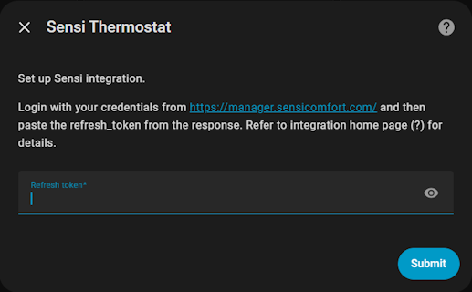

[](https://packagist.org/packages/phplicengine/bitly)
<a href="https://buymeacoffee.com/leolite1q" target="_blank"></a>

## Summary

This integration allows displaying and controlling [Sensi](https://sensi.emerson.com/en-us) thermostat.

It was developed by reverse engineering the mobile app and original work done by https://github.com/w1ll1am23/pysensi, so the integration could fail at some point.


## Setup

You need the refresh_token to setup the integration.

### Refresh Token

Sensi app v8.6.3+ now requires reCaptcha-based authentication. Since this cannot be replicated programmatically, you must obtain a refresh token manually:

1. Open Chrome or Edge and go to https://manager.sensicomfort.com/
1. Press F12 to open DevTools, then select the `Network` tab
1. Log in with your credentials (no need to subscribe or proceed further)
1. In DevTools, find the `token?device=` request and copy the `refresh_token` value from its Response

**Note:** You may see two requests; use the one with a Response.


This process works in other browsers as well. Repeat these steps if you change your password.

### Add Integration

Add Sensi integration using the `Add integration` button on Integrations page of your HomeAssistant instance.



On adding the Sensi integration, you should see one device and some related entities.


## Features
- Single target temperature only (temperature ranges not supported). Manually set heat/cool modes.
- Operating modes: `Auto, Heat, Cool, Off` (available modes depend on thermostat configuration).
- Fan modes: `Auto, On, Circulate` (10% duty cycle). Circulation mode availability depends on thermostat.
- Data is refreshed every 30 seconds.


## Configuration Options

Available settings (support varies by thermostat):
- Auxiliary Heating
- Continuous Backlight
- Display Humidity
- Display Time
- Fan
- Humidification
- Keypad Lockout


### Auxiliary Heating

As of HomeAssistant 2024.4.0, auxiliary heating appears as a switch under device configuration rather than as a climate attribute. Note: HomeAssistant displays aux heating as "Heating" action.

### Humidification

Available on thermostats with humidification support.
- Humidity control configured as a configuration setting.
- HomeAssistant card supports humidity level only.
- Sensi uses 5% increments; values are rounded to the nearest step.
- When enabled, the climate entity gains: `min_humidity`, `max_humidity`, `humidity` (target), and `current_humidity` attributes.
- Dehumidification is not supported.

### Sensors

**Enabled by default:**
- Temperature
- Humidity

**Disabled by default:**
- Battery
- Min/Max setpoints
- Fan speed
- WiFi strength


### Attributes
Sample attributes on the climate entity:


```
hvac_modes: off, heat, cool, auto
min_temp: 50
max_temp: 73
target_temp_step: 1
fan_modes: auto, on, Circulate
current_temperature: 69
temperature: 69
current_humidity: 51
fan_mode: Circulate
hvac_action: heating
circulating_fan: true
circulating_fan_duty_cycle: 10
attribution: Data provided by Sensi
friendly_name: Living Room
supported_features: 397
min_humidity: 5
max_humidity: 50
humidity: 5
```

## Issues

Simultaneous logins from the mobile app and integration typically work without issues. However, thermostat property changes may occasionally fail to apply, potentially due to Sensi backend issues or the thermostat temporarily going offline.


## Installation

- Download and copy all the files from `custom_components/sensi/` to `<config directory>/custom_components/sensi/`.
- Restart HomeAssistant.
- Create an account on the Sensi mobile app.
- Add the integration using the `Add Integration` button in Integrations page on your Home Assistant instance.

## Configuration

None

## Breaking Changes

### Revision 2.0.0

Major rewrite with breaking changes and new features:
- Internal architecture rewritten to use python-socketio instead of websockets
- Thermostat temperature and settings now align with Sensi app for improved reliability
- Humidification support added
- Configuration setting and sensor names/IDs corrected


### Revision 1.3.0
Switched to `refresh_token` instead of userName/password for authentication.


### Revision 1.2.0

The entity/unique ids have been correct. Unfortunately, this will cause the previous entities to appear duplicate/disabled. You would want to remove the previous entities and reference the new ones. The new entity_id is based on the name given to the thermostat and not the device_id which is more accessible.

### Revision 1.1.1

The battery level is now computed based on a formula. It is not perfect but should give some idea of the battery state. The battery voltage itself is now available as an attribute. You will see a warning like The unit of `sensor.sensi_36_6f_92_ff_fe_02_24_b7_battery (%) cannot be converted to the unit of previously compiled statistics (V).`

### Revision 1.1.0

The entity ids have changed to support multiple thermostats on the same account. Your previous entities would appear duplicate/disabled. You would want to remove the integration and add it back.
